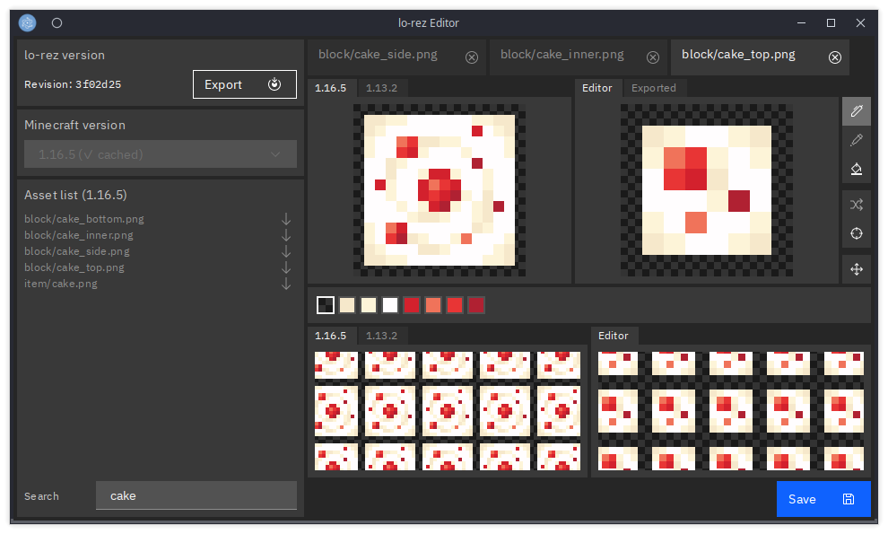

# lo-rez-editor

Surprise! It's a [Svelte](https://svelte.dev) rewrite!



Rumour has it, I was trying to make some changes to the old editor and almost had a heart attack (and we don't want that to happen, do we?).

It is broken, outdated and hard to maintain.
[I make a new one](https://www.youtube.com/channel/UCMrMVIBtqFW6O0-MWq26gqw).


## Usage

If you want to try it early, just install all packages, build the theme and start the application:

```shell
npm ci
npm run build
npm run start
```

This assumes you have got NodeJS installed.

You need to run `build` only once when the `ui-theme.scss` or the Carbon style has changed.
For development, `build:gui` or `watch:gui` is sufficient.
